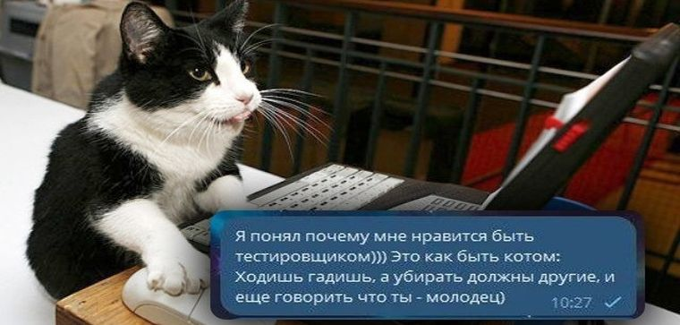
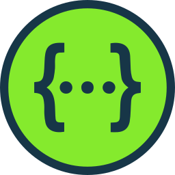

## Hi, my name is Sergey. I'm a QA Engineer with 3 years of commercial experience

&nbsp;

**Some stuff about me:**

- 👨🏽‍💻 I'm currently working for "ADEPT";
- 💬 I'm open to any kind of communication;
<!-- - 💡 My Certificates and test [Artifacts](https://github.com/LapushanskyiSergey/Artifacts/blob/main/README.md); -->
- 📫 How to reach me: lapushsergey@gmail.com;
- 🐈 Fun-fact: I love cats

&nbsp;

**Tools:**

  <code><figure><figcaption>Postman</figcaption></figure></code>
  <code><figure><figcaption>Postgre</figcaption></figure></code>
  <code><figure><figcaption>Git</figcaption></figure></code>
  <code><figure><figcaption>Swag</figcaption></figure></code>
  <code><figure><figcaption>Jira</figcaption></figure></code>
  <code><figure><figcaption>Charl</figcaption></figure></code>
  <code><figure><figcaption>Test</figcaption></figure></code>

 

  

